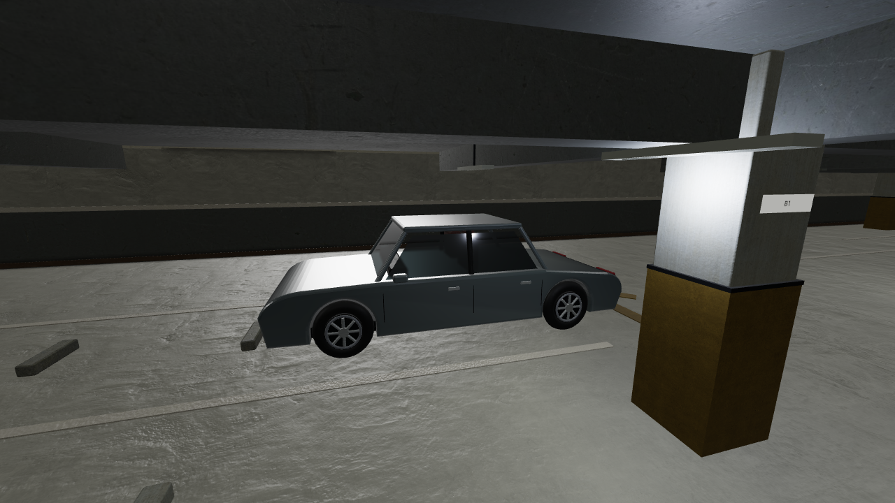
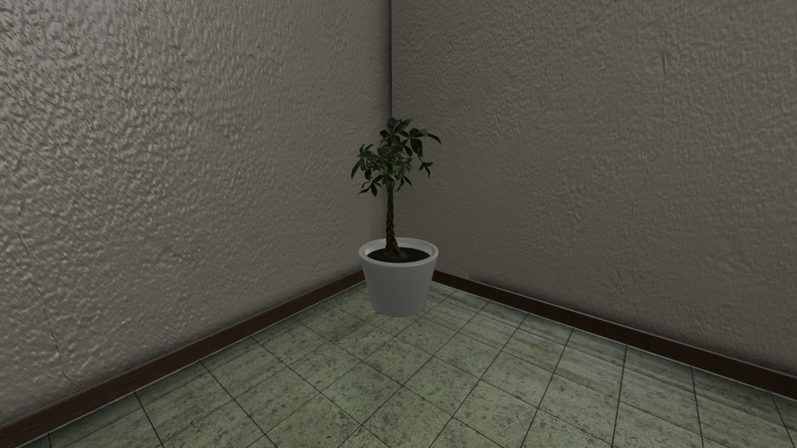
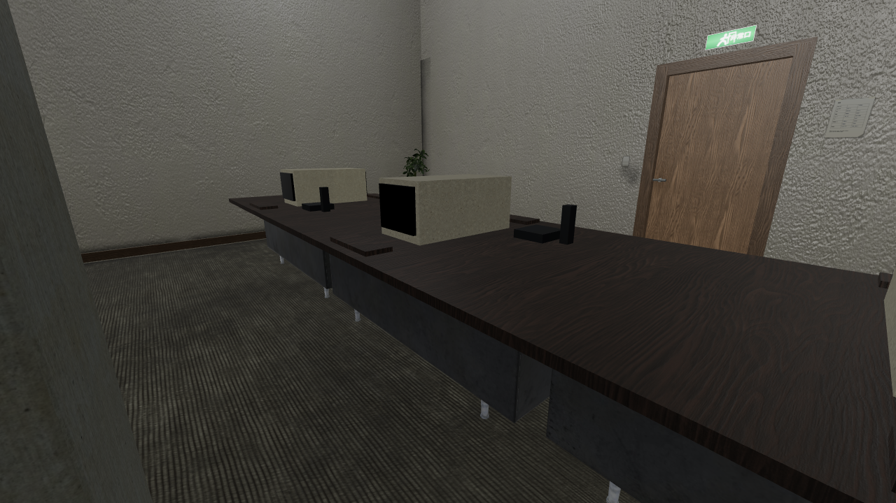
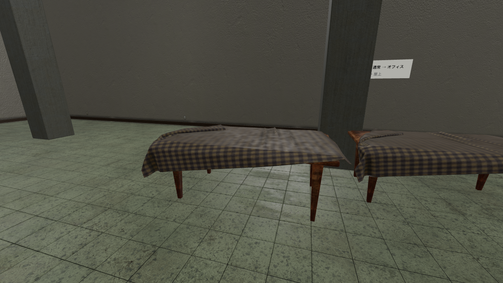

# V05 オブジェクトの輪郭・PBR改善（2026-09-17）

## 状態

**一次改善を実装・検証済み。全オブジェクトのプロ品質到達を意味しない。** 既存のモデル置換機構を復旧し、専用形状が必要な車・植栽を追加した。V05の接写品質、全家具の意味タグ、LOD、最終の目視承認は継続対象。

## 実装した内容

| 対象 | 変更 | 適用範囲 |
|---|---|---|
| 車両 | 車輪の切り欠きを持つ押し出し車体、傾斜ガラス、A/Bピラー、屋根、タイヤ、リムとスポーク、ミラー、取っ手、ドア境界、グリル、灯具、簡易車内。1台16,388三角形 | StreetGeneratorのcar、U16のcarAt。既存車のみ。空のC06へ新規車両は追加しない |
| 塗装・ガラス | 既存carPaintのclearcoat、carGlassの物理材質、金属・ゴム・内装材を分離。部屋の照明・霧・影の共有経路を使用 | 車両の材質別メッシュをチャンクで結合 |
| オフィス机 | Poly Haven metal_office_desk、1Kカラー・normal・ARMのglTF | kind=desk。U14 seed42では88台、E09/R16等も寸法適合時に置換 |
| テーブル | Poly Haven dining_table、1K PBR | kind=table。E17 seed42で16台。テーブルクロス付きのモデルなので全家具への流用は禁止 |
| 鉢植え | pachira_aquatica_01のa個体、幹・葉のPBR。既存の鉢を回転体の陶器形状にし、土を独立材質で追加 | plantUnitの鉢と葉をpropGroupで関連付け、葉だけをモデルへ置換。鉢の衝突を維持。U06/U14で各2株 |
| その他の植栽 | 球体の葉群を湾曲した葉・葉柄・枝へ、plantの反復箱も葉群へ、grassの反復箱は曲がった草葉へ置換 | 共通RoomBuilder。lowでは密度低減。薄いソリッドの生垣仕切りは境界を見失わないよう既存表示を維持 |
| モデル描画 | 通常起動で有効、初室生成前にindex読込待ち。モデル内の同材質メッシュを結合してInstancedMesh化、投影・受影。配置角ジッターを廃止し枠からの突出を防止 | `?props=0`でglTF置換のみ無効。車・手続き植栽の無効化ではない |
| 非同期読込 | 代替箱を材質×チャンクで管理。モデル到着時に差替え、破棄済み部屋には追加しない | 既存の寿命管理に統合 |

候補10モデルを取得・検討後、今回実際に採用した3モデルのみを配布。不要な7モデルは今回取得分から除去した。既存manifestの69件は過去の取得記録であり、現行配布数ではない。実体は`public/cc0/models/index.json`を参照。

### 由来と再現

- [Poly Haven CC0利用条件](https://polyhaven.com/license)
- [metal_office_desk](https://polyhaven.com/a/metal_office_desk)、[pachira_aquatica_01](https://polyhaven.com/a/pachira_aquatica_01)、[dining_table](https://polyhaven.com/a/dining_table)
- 取得定義: `assets/cc0/selection-props.json`
- 再取得: `python3 tools/fetch-cc0-assets.py assets/cc0/selection-props.json --models`
- 配布書出し: `npm run build:cc0:models`
- 車、枝葉、草、鉢は本プロジェクトでコード生成。新しいAI画像生成は行っていない。従来の生成テクスチャと採用モデル付属PBR画像を使用。

## 不変条件

車・鉢に表示用メタデータを追加するだけで、元のmin/max/solid、配置数、乱数呼出し、入口・出口、セーブ形式は変更しない。RoomBuilderは元のboxから衝突を作成し、置換は描画専用。車は表示全体のAABBを既存の車体幅・長さ・元部品全体の高さに収める。葉・草も元の表示枠を超えないことをテストする。glTFは一様縮尺と既存の75万三角形/室予算を適用。植栽モデルのみ縮尺下限を0.65とし、上限は1.25。広い植栽帯へ小さな鉢を配置しない。

衝突と形状の厳密一致は未達。机列の隙間や葉群の透けた場所にも元の衝突体がある。ゲーム仕様を変えずに次段階で接写と移動を確認すること。

## 検証

- `npm run typecheck`、`npm run build`成功。既存の大きなバンドル警告は残る。
- `node tests/object-geometry.mjs`: X/Z方向車体の境界・有限座標・入力非破壊、5寸法の枝葉の決定性・境界・low密度、草の境界・三角形上限に合格。
- 開発用素材レビューの「オブジェクト検査」でU06/U14/U16/R07/E17 × low/mid/highを描画。shader、texture、propの読込エラー0。結果は`validation.json`。
- 同一seedの品質切替で各室の衝突数が一致。全seed・全variantの移動試験、実機スマホ、GPU時間の測定は未実施。
- レビュー画像は撮像効果OFF、seed42、variant0、high、露出1.25。素材レビューの照明・トーンマッピングであり、本編の最終撮像品質判定とは区別する。

### 保存画像

| 車 | 鉢植え |
|---|---|
|  |  |

| オフィス机 | テーブル |
|---|---|
|  |  |

温室の共通植栽は`R07-foliage.png`。各画像のJSONにカメラ・描画条件・モデル数を保存。

## 次のAIが行う作業（優先順）

1. **車の接写品質**: 現在は識別性を改善した手続き型セダン。ボンネット・フェンダー・ルーフの断面を連続曲面へ、ワイパー・灯具内部・タイヤ溝・ドアの実際の開口線を追加。車用のUVと局所汚れを制作。実物写真に対して側面・前後斜め・低視点で比較し、平板に見える面をなくす。採用可能な通常車種の高品質モデルを見つけた場合もライセンスと寸法を記録する。
2. **植物の種別化**: 葉群・草は形状近似であり、植物学的に正確な樹種モデルではない。生垣、シダ、蔓、樹木を分け、正しい葉・茎の接続と葉脈、裏面の明るさを実装。R07の吊り植物は支持点との接続も確認。薄い衝突付き植栽仕切りを疎な葉へ置き換えて透明な障害物にしない。
3. **残る家具**: U10/C09等の机・椅子は部品boxの集合でkindがない。生成器の意味を使ってpropGroupと方向を付与し、既存部品を重ねて残さない。椅子、ソファ、棚、ロッカー、CRTなどの輪郭を順に改善。材質だけで全家具を机に分類しない。現在の88台のオフィス机や16台のクロス付きテーブルを別種家具へ流用しない。
4. **照明と接地**: モデルの静的照明はインスタンス中心の定数サンプル。脚、天板裏、葉裏の細かな陰影はまだ不足する。モデル頂点AO/ライトプローブかモデル用焼き込みを実装し、GTAO・影と重ねて黒くなりすぎないよう検証する。
5. **性能**: メッシュの結合はdraw call削減のみ。lowでもglTFは同じ密度のまま。車・家具・植物のLODを作成し、距離と画面占有率で切替。R07の枝葉密度、U14の机列は実機GPU時間とストリーミング負荷を測って決める。検査の三角形数にはガラス透過の追加パスが含まれ得るのでbuilt.trianglesと混同しない。
6. **最終受入**: 本編で移動・扉・隣室・セーブ復元を確認。車・机の見た目と元衝突のずれを記録。今回の15描画ケース合格をV05全体や「プロ品質」の合格と扱わない。
